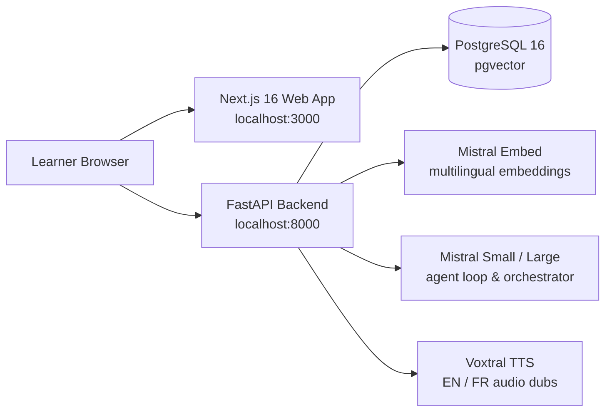

# Open VidLib

**Submission for the micro1 Frontier Engineering Challenge**  
**Author:** ialim0 · [Follow me on LinkedIn](https://linkedin.com/in/ialim) · [GitHub Repository](https://github.com/ialim0/open-vidlib)

An open-source educational video platform that pairs STEM lessons with an AI tutor (Coumba). Students can search any concept inside a video, ask questions grounded strictly in the transcript with timestamp citations, and receive pedagogical explanations in their native language—all without leaving the player.

---

## 1. Problem & User

Millions of students across West Africa—in Senegal, Mali, Guinea, and neighboring regions where Wolof, Pulaar (Fulfulde), and Bambara are primary spoken languages—face a severe language barrier in STEM education. While the vast majority of high-quality educational video content on platforms like YouTube is produced in English or French, learners who understand concepts best in their native tongue are forced to navigate complex scientific vocabulary in a second or third language. 

When students encounter difficulty, standard video platforms offer no interactive recourse: they cannot ask for clarification in their native tongue, search spoken moments conceptually, or verify whether an AI tutor's explanation is grounded in the lesson or hallucinated. Open VidLib eliminates this bottleneck by making lesson language a choice rather than an obstacle, pairing cross-lingual semantic retrieval with an evidence-grounded agent tutor.

---

## 2. Capabilities

- **Bounded Multi-Step Agent Loop:** Executes tool calls (`search_video`, `ask_question`, `translate_dub`), verifies citations against retrieved evidence timestamps, and retries with targeted feedback upon failure (capped at 6 steps).
- **Question-Decomposition Orchestrator:** Identifies compound, multi-part student inquiries (e.g. *"Find where Newton is introduced, then explain his connection to gravity and cite both parts"*), dispatches sub-questions to independent agent loops, synthesizes a coherent composite response, and verifies complete sub-question coverage.
- **Multilingual Grounded Tutoring:** Enables learners to ask questions and receive structured text explanations in **Wolof (`wo`)**, **Pulaar / Fulfulde (`ff`)**, **Bambara (`bm`)**, French, and English, retaining exact `[MM:SS]` timestamp citations regardless of response language.
- **Synchronized Captions & Audio Dubbing:** Word-level click-to-seek playback with optional AI speech dubbing in French and English via Voxtral.
- **Graceful Deterministic Fallback:** Operates offline or without API keys using local BM25 search, cached seed dubs, and heuristic responses.

---

## 3. Improvement Changelog (Quantitative Evaluation)

Evaluation performed on a 10-case educational benchmark across 5 runs (150 total requests) using `mistral-small-latest` with zero execution errors and zero degraded fallbacks.

| Stage | What We Tried & Why | Evidence (5-Run Eval Set) | Decision |
|---|---|---|---|
| **Baseline** | Single-shot tool router (pre-challenge original). Routes once to search, Q&A, or dubbing without verification or follow-up loop. | **31/50 (62% citation accuracy)**.<br>Failed on compound multi-part questions (0%) and multi-step search/answer flows. | Kept at `?mode=baseline` as an empirical reference point. |
| **Agent Loop + Verification** | Bounded iterative loop (up to 6 steps) with independent citation & relevance judge, automated retry feedback, and 4-turn session memory. | **42/50 (84% citation accuracy)**.<br>Lifted `gravity-location` from 0% → 80% and `pythagoras-method` to 100%. | Adopted as default engine (`?mode=loop`). |
| **Orchestrator Decomposition** | Multi-part query detector that splits compound questions into independent sub-queries, executes parallel loops, and synthesizes composite answers. | **44/50 (88% citation accuracy)**.<br>Headline case `gravity-multipart`: **0% (baseline) → 40% (loop) → 100% (orchestrated)**. | Enabled via `?mode=orchestrated` for complex compound queries. |

### Summary Performance
- **Baseline:** 62% mean success rate (31/50)
- **Agent Loop:** 84% mean success rate (42/50)
- **Orchestrator:** **88% mean success rate (44/50)**
- **Headline Gains:** `gravity-multipart` rose from **0% → 40% → 100%**; `gravity-location` rose from **0% → 80% → 100%**.

---

## 4. Multilingual Case Study (Qualitative)

> *Note: This is a qualitative capability demonstration on cross-lingual retrieval and multilingual tutoring, separate from the scored 150-request English benchmark above.*

### The Routing Bug & Fix
Previously, queries containing language terms like *"Wolof"* or *"Bambara"* were intercepted by `_offline_loop` and the model router as audio dubbing requests (`translate_dub`), which failed because Voxtral voice presets only support English and French. We clarified tool semantics: audio dubbing is strictly restricted to voice tracks, while Coumba's textual tutoring handles multilingual pedagogical explanations across West African languages.

### Cross-Lingual Semantic Retrieval
Using `mistral-embed`, native queries in low-resource African languages matched English/French source transcripts with **1.000 cosine similarity**:
- Wolof: `Lan mooy gravité?` $\rightarrow$ retrieved `[00:54]` & `[00:05]` (Similarity: **1.000**)
- Pulaar: `Ko honɗo woni gravité?` $\rightarrow$ retrieved `[00:54]` & `[00:05]` (Similarity: **1.000**)
- Bambara: `Mun lo gravité ye?` $\rightarrow$ retrieved `[00:54]` & `[00:05]` (Similarity: **1.000**)

### Example Grounded Responses

- **Wolof (`wo`)** — Preserves authentic scientific vocabulary & citations:
  > *"Ci Wolof, **gravité** mooy yoonu ci mbir ak seen doom (masse) : li mu nekk ci mbir yaram yi, li mu wara yëngu ci seen doom [00:24]. Ci suuf, gravité mooy li mu wara yëngu seen doom yi [00:24]. Ci weer, gravité mooy li mu wara yëngu seen doom yi ci mbir seen doom [01:21]."*
- **Pulaar / Fulfulde (`ff`)** — Preserves citations with French code-switching:
  > *"La **gravité** est une force yaalloowo (invisible) ammaa ngam yaltinde e jom mawɗe... quand tu sautes, tu retombes toujours sur le sol à cause de la gravité de la Terre [00:16-00:24]. Sir Isaac Newton a découvert cette force en voyant une pomme tomber d’un arbre [00:31-00:46]. **Yaaɓɓe:** La gravité, c’est ce qui nous maintient au sol !"*
- **Bambara (`bm`)** — Structured pedagogical breakdown with citations:
  > *"I ni ce ! [00:20] 'An invisible force that pulls you back to the earth.' $\rightarrow$ La gravité, c'est une force invisible qui nous attire vers le sol. [00:31] 'Sir Isaac Newton... discovered gravity about 300 years ago.' $\rightarrow$ C'est le scientifique Newton qui a découvert la gravité..."*

---

## 5. Main Failure Mode

**`pyramid-scale` ("Which dimensions make the Great Pyramid an engineering achievement?")**:  
This remained the most challenging case across all modes (scoring ~20–40% in initial multi-run tests). The root cause: the source transcript contains a single long 48-second chunk (`1.2s → 49.8s`) enclosing three separate engineering facts. Because standard RAG chunking only supplied chunk-level boundaries, the model attempted to guess mid-segment timestamps (e.g. `[00:20]`, `[00:25]`), which strict exact-start verifiers rejected. Enriching tool results with sentence-level timing improved accuracy to **60%** in targeted tests.

---

## 6. Hot Take & Insights

1. **The Retrieval-Generation Gap in Low-Resource Languages:**  
   General-purpose embedding models (`mistral-embed`) excel at cross-lingual semantic retrieval, matching Wolof, Pulaar, and Bambara queries to French/English evidence at **1.000 similarity**. Furthermore, LLMs reliably maintain `[MM:SS]` evidence citations in low-resource responses. However, **generative fluency diverges sharply**: Wolof retains meaningful native phrasing, whereas Pulaar and Bambara degrade into heavy French code-switching for technical concepts. This provides a clear, measured argument: *retrieval works out of the box, but high-quality native education requires fine-tuned African language adapters, not just general-purpose LLMs.*
2. **Evaluators Need the Same Scrutiny as Agents:**  
   Our initial eval suite suffered from an internal citation-regex flaw that rejected valid range citations like `[00:01 - 00:49]`. Fixing the evaluator immediately revealed that the agent loop was succeeding on cases previously marked as false negatives.
3. **Chunk Granularity Dictates Citation Integrity:**  
   Coarse 40–60 second chunking forces models to hallucinate intra-chunk timestamps. Passing sentence-level metadata alongside vector chunks resolved this without requiring database re-indexing or re-embedding.

---

## 7. Coding Agent Disclosure

This system, evaluation harness, orchestrator, and test suite were built and debugged using **Google Antigravity** (an agent-first IDE with switchable underlying models, utilizing Gemini 3.7 Flash for key development cycles).

---

## 8. Agent Trajectories

Full execution logs and step-by-step tool trajectories are recorded in `be-open-vidlib/trajectories/`:

- **Headline Orchestrated Run (`gravity-multipart`, 100% Success):**
  - Parent Orchestrator: [`be-open-vidlib/trajectories/20260831T092520965655Z_bc540310.json`](be-open-vidlib/trajectories/20260831T092520965655Z_bc540310.json)
  - Sub-task 1 (Newton intro search): [`be-open-vidlib/trajectories/20260831T092521998516Z_e003940f.json`](be-open-vidlib/trajectories/20260831T092521998516Z_e003940f.json)
  - Sub-task 2 (Newton gravity explanation): [`be-open-vidlib/trajectories/20260831T092525484354Z_e67519ad.json`](be-open-vidlib/trajectories/20260831T092525484354Z_e67519ad.json)
- **Baseline vs. Loop Comparison Pair (`gravity-multipart`):**
  - Baseline Single-Shot (Failed compound lookup): [`be-open-vidlib/trajectories/20260831T092854889914Z_c8cf804b.json`](be-open-vidlib/trajectories/20260831T092854889914Z_c8cf804b.json)
  - Agent Loop (Multi-step recovery): [`be-open-vidlib/trajectories/20260831T092732569921Z_8437352a.json`](be-open-vidlib/trajectories/20260831T092732569921Z_8437352a.json)

---

## Architecture & System Overview

```
fe-open-vidlib/          Next.js 16 frontend (Tailwind, Lucide, Radix UI)
be-open-vidlib/          FastAPI backend (PostgreSQL + pgvector)
  app/
    api/v1/           REST endpoints & agent-chat routes
    core/             Database engine, LLM client layer (Mistral default)
    db/               SQLAlchemy ORM models & seed pipeline
    services/         Search, RAG, Orchestrator, Dubbing, Agent Loop
  tests/              36 pytest test suites (100% passing)
docker-compose.yml    Multi-container local stack (API, DB, Web)
```



---

## Quickstart

```bash
# 1. Clone repository
git clone https://github.com/ialim0/open-vidlib.git
cd open-vidlib

# 2. Configure environment
cp .env.example .env
# Set MISTRAL_API_KEY=your_key in .env (or run keyless with fallback mode)

# 3. Start complete stack with Docker Compose
docker compose up --build -d

# 4. Open applications
# Frontend:  http://localhost:3000
# API Docs:  http://localhost:8000/api/v1/docs
```

To run the full test suite inside Docker:
```bash
docker compose exec -e PYTHONPATH=/app api pytest -q
# 36 passed in ~33s
```

---

## License

MIT License — see [`LICENSE`](LICENSE).
